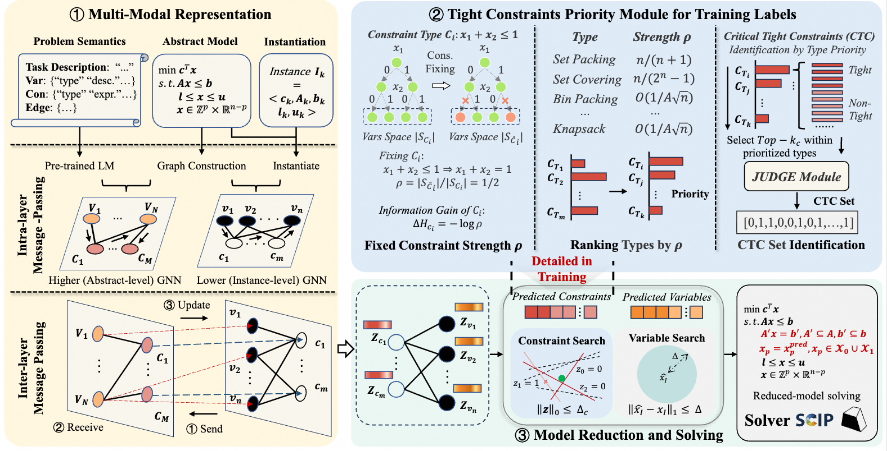
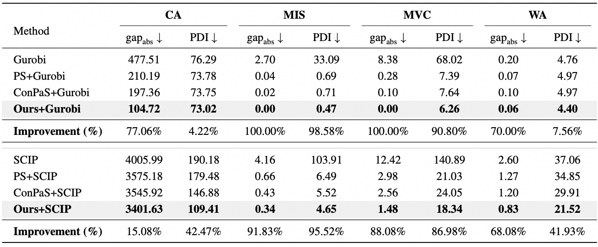

# Constraint Matters: Multi-modal Representation for Reducing Mixed-Integer Linear Programming

Official implementation of the paper: **"CONSTRAINT MATTERS: MULTI-MODAL REPRESENTATION FOR REDUCING MIXED-INTEGER LINEAR PROGRAMMING"**, accepted by **ICLR 2026**.

---

## 🌟 Overview

Model reduction is a powerful way to accelerate large-scale Mixed-Integer Linear Programming (MILP). While most existing methods focus on **variable reduction**, this paper explores the untapped potential of **constraint reduction**.

### Core Contributions:
1.  **Constraint-based Model Reduction Framework**: A novel approach that transforms critical inequality constraints into equalities to shrink the search space.
2.  **Critical Tight Constraints (CTC) Identification**: An information theory-guided heuristic to select constraints that most effectively reduce solution space uncertainty.
3.  **Multi-modal Representation**: A bi-level encoding that integrates instance-level structural information (GNN) with abstract-level problem semantics (LLM/Text Embeddings).
4.  **Performance**: Improves solution quality by **>50%** and reduces computation time by **17.47%** compared to SOTA solvers like Gurobi and SCIP.

---

## 🏗️ Framework

*Figure: Overview of the multi-modal representation and constraint reduction pipeline.*

*Main Results*

---

## 🔧 Installation

### Prerequisites
- Python 3.8+
- [Gurobi Optimizer](https://www.gurobi.com/) (License required)
- [SCIP Solver](https://scipopt.org/)

### Setup Environment
Coming Soon！

### Quick Start
Coming Soon！

