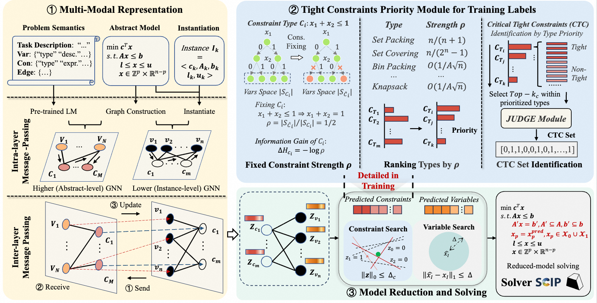
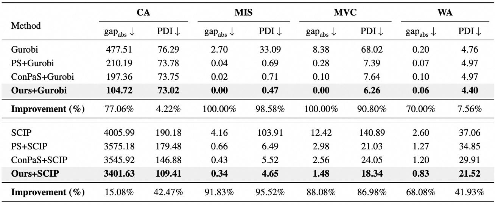

# Constraint Matters: Multi-modal Representation for Reducing Mixed-Integer Linear Programming

[](https://arxiv.org/abs/2508.18742)
[](https://www.python.org/)
[](https://opensource.org/licenses/MIT)

Official implementation of the paper: **"CONSTRAINT MATTERS: MULTI-MODAL REPRESENTATION FOR REDUCING MIXED-INTEGER LINEAR PROGRAMMING"**, accepted by **ICLR 2026**.

---

## 🌟 Overview

Model reduction is a powerful way to accelerate large-scale Mixed-Integer Linear Programming (MILP). While most existing methods focus on **variable reduction**, this paper explores the untapped potential of **constraint reduction**.

### Core Contributions:
1.  **Constraint-based Model Reduction Framework**: A novel approach that transforms critical inequality constraints into equalities to shrink the search space.
2.  **Critical Tight Constraints (CTC) Identification**: An information theory-guided heuristic to select constraints that most effectively reduce solution space uncertainty.
3.  **Multi-modal Representation**: A bi-level encoding that integrates instance-level structural information (GNN) with abstract-level problem semantics (LLM/Text Embeddings).
4.  **Performance**: Improves solution quality by **>50%** and reduces computation time by **17.47%** compared to SOTA solvers like Gurobi and SCIP.

---

## 🏗️ Framework


*Figure: Overview of the multi-modal representation and constraint reduction pipeline.*


*Main Results*

---

## Repository structure
```

dataset                 //training data, generated by gurobi.py(data generate scripts)

instance

​	–train                 //training and evaluation instances 

​	–test                  //test instances

logs                    //all test logs

models                 //trained model,  used to test model performance

pretrain                // training model folder will be saved here
```


## Requirements

Linux

–python 3.10.13

–pytorch 2.4.1 (cuda=12.4)

–cudatoolkit 12.4

–pyscipopt 4.4

–gurobipy  9.5.2

–pyg 2.6.1

## 🔧 Installation

Create a new environment with [Conda](https://docs.conda.io/en/latest/)

```
conda env create -f py310.yaml

conda activate pytest
```


## Quick Start

### Data generation

the Independent Set (IS) instance  and the Combinatorial Auction (CA) instance  use [Ecole](https://www.ecole.ai/) library to generate.

the Balanced Item Placement (denoted by IP) instance and the Workload Appointment (denoted by WA) instance come from the ML4CO 2021 competition [generator](https://github.com/ds4dm/ml4co-competition-hidden). 

Place the generated instances in the instance folder

```
python gurobi.py
```

The corresponding bipartite graph(BG) and solution will be automatically generated in the dataset folder.

### Train 

Select the parameter TaskName in model_train.py, and then

```
python model_train.py
```

### Test

Put the trained model into the models folder, then

```
python model_test_SCIP.py

python model_test.py
```

all solver logs will be saved in logs folder.

